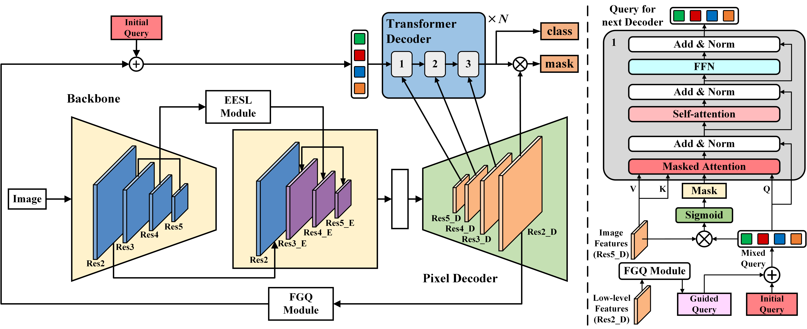

# GQ-Former: Edge-Guided Query Initialisation for Robust Railway Scene Segmentation

[**Jiawei Peng<sup>1,2</sup>**](https://github.com/pjw-yellow), **Liqiang Zhu<sup>1,2,3</sup>**, **Jingyu Hu<sup>1,2,3</sup>***, **Kexun Wang<sup>1,2</sup>**, **Zhihao Huang<sup>2,3</sup>**

<sup>1</sup> Frontiers Science Center for Smart High-Speed Railway System of Beijing Jiaotong University  
<sup>2</sup> School of Mechanical, Electronic and Control Engineering of Beijing Jiaotong University  
<sup>3</sup> State Key Laboratory of Advanced Rail Autonomous Operation of Beijing Jiaotong University

---

🔔 **Manuscript Status**  
This code corresponds to a manuscript currently submitted to *The Visual Computer*.  
Please cite the paper if you find this repository useful.

---

## 1. Overall Framework

<div align="center">
  
</div>

### Features
* **FGQM** initializes queries with low-level spatial features, improving query–pixel alignment and decoding stability.
* **EESLM** enhances boundary perception by integrating edge-aware cues from mid-to-high-level features.
* **GQ-Former** achieves **66.74%** mIoU on the [RailSem19](https://openaccess.thecvf.com/content_CVPRW_2019/html/WAD/Zendel_RailSem19_A_Dataset_for_Semantic_Rail_Scene_Understanding_CVPRW_2019_paper.html) dataset, outperforming existing state-of-the-art methods.

## 2. Datasets and Pretrained Models

### Datasets Preparation

This project uses the RailSem19 dataset.
Due to data protection and licensing requirements specified by the dataset provider,
we are not permitted to redistribute the raw dataset or its annotations.
Please download the dataset directly from the official WildDash website:  
https://www.wilddash.cc/railsem19

The dataset is released under specific license terms.
For detailed information, please refer to the official license agreement:
https://www.wilddash.cc/license/railsem19

We provide data preparation scripts `railsem19scripts.py` to facilitate dataset usage.
Please ensure that the downloaded dataset is organized according to the directory structure
shown below, as the scripts assume fixed relative paths defined in this README.

```text
railsem19/
├── rs19_splits4000/
│   ├── train.txt
│   ├── val.txt
│   └── test.txt
├── rs19_val/
│   ├── jpgs/
│   │   └── rs19_val/
│   │       ├── rs00000.jpg
│   │       ├── rs00001.jpg
│   │       └── ...
│   ├── jsons/
│   ├── uint8/
│   │   └── rs19_val/
│   │       ├── rs00000.png
│   │       ├── rs00001.png
│   │       └── ...
│   ├── authors.txt
│   ├── example-vis.py
│   ├── license.txt
│   ├── readme.txt
│   └── rs19-config.json
└── license.txt
```
Then run the following command:

```bash
python railsem19scripts.py --src_root path/to/railsem19 \
--out_root path/to/myr19pros \
--mode copy
```
We recommend naming the processed dataset `myr19pros` to keep it consistent with the dataset name defined in the code, enabling direct evaluation.

Finally, specify the correct paths to the image and annotation directories by setting `root_img` and `root_mask` in `register_rs19pros.py`.

### Pretrained Models Preparation

We provide pretrained weights for GQ-Former to facilitate evaluation and reproducibility.

📌 GQ-Former Pretrained Weights

- **Training dataset:** RailSem19  
- **Performance:** **66.74% mIoU** on the validation set  
- **Download (Zenodo DOI):**  
  👉 **https://doi.org/10.5281/zenodo.18309011**

---

If you plan to retrain the model from scratch, you must first prepare a
**ResNet-101 backbone pretrained on ImageNet**.

- **ResNet-101 (ImageNet pretrained, BatchNorm):**  
  👉 https://dl.fbaipublicfiles.com/detectron/ImageNetPretrained/MSRA/R-101.pkl

In your configuration file, specify this file as the backbone initialization.

## Installation

```bash
conda create --name gqformer python=3.8.20 -y
conda activate GQformer
pip install torch==1.12.1+cu116 torchvision==0.13.1+cu116 torchaudio==0.12.1+cu116 \
  --extra-index-url https://download.pytorch.org/whl/cu116
pip install -U opencv-python==4.12.0.88

# under your working directory
git clone git@github.com:facebookresearch/detectron2.git
cd detectron2
pip install -e .
pip install git+https://github.com/cocodataset/panopticapi.git
pip install git+https://github.com/mcordts/cityscapesScripts.git

cd ..
git clone git@github.com:pjw-yellow/GQFormer.git
cd GQFormer
pip install -r requirements.txt
cd mask2former/modeling/pixel_decoder/ops
sh make.sh
```

## Getting Started

To evaluate GQ-Former on the validation set, run the following command:

```bash
python python train_net.py \
--config-file /path/to/GQFormer_R101_bs16_90k.yaml \
--eval-only MODEL.WEIGHTS /path/to/GQFormer_model_final_miou6674.pth
```

To train GQ-Former from scratch, run the following command:

```bash
python train_net.py \
  --config-file /path/to/GQFormer_R101_bs16_90k.yaml \
  --num-gpus 1 
```

## Acknowledgement

Code is largely based on Mask2Former (https://github.com/facebookresearch/Mask2Former).

